## Детальні кроки для розгортання Data Platform на AWS за допомогою CloudFormation та налаштування ETL процесів з Glue і Athena

#### Перевірити AWS CLI конфігурацію
```
aws sts get-caller-identity
aws configure get region
```

#### Встановити змінні оточення для проекту
```
export PROJECT_NAME="sergii-data-platform"
export REDSHIFT_PASSWORD=bsm6067SergiiRedshift
export AIRFLOW_PASSWORD=bsm6067SergiiAirflow
```

#### Показати змінні (паролі частково приховані)
```
echo "PROJECT_NAME=$PROJECT_NAME"
echo "REDSHIFT_PASSWORD=${REDSHIFT_PASSWORD:0:4}****"
echo "AIRFLOW_PASSWORD=${AIRFLOW_PASSWORD:0:4}****"
```

#### Створити сервісну роль для ECS (якщо її ще немає)
```
aws iam create-service-linked-role --aws-service-name ecs.amazonaws.com --region us-east-1
```

### Налаштувати файл конфігурації 'DataPlatform.yml' з правильними значеннями параметрів перед запуском цього скрипту

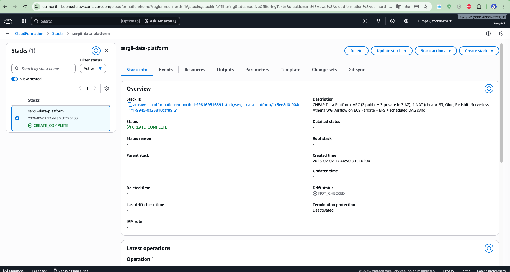
### Відкрий AWS Console → CloudFormation → Stacks → Create stack → With new resources (standard)
### Розгорнути стек CloudFormation за допомогою `DataPlatform.yml`

### Вибери 'Upload a template file' і завантаж 'DataPlatform.yml'

### Введи параметри:
#### ProjectName: sergii-data-platform
#### RedshiftMasterUsername: admin
#### RedshiftMasterPassword: bsm6067SergiiRedshift
#### AirflowAdminUsername: admin
#### AirflowAdminPassword: bsm6067SergiiAirflow

#### Натисни 'Next', налаштуй опції за потреби і натисни 'Create stack'
#### Дочекайся завершення створення стеку
#### Після створення стеку, перевір URL Airflow виведений в Outputs стеку CloudFormation
#### Відкрий URL Airflow в браузері і увійди з використанням наданих облікових даних
#### Використовуй Airflow для управління та моніторингу ETL процесів в Redshift

#### Копіюємо файли в S3 бакет
```
aws s3 cp --recursive data "s3://data-platform-data-lake-eu-north-1-998169516591/raw/" \
  --exclude ".DS_Store" --exclude "*/.DS_Store" \
  --profile sergii --region eu-north-1
```

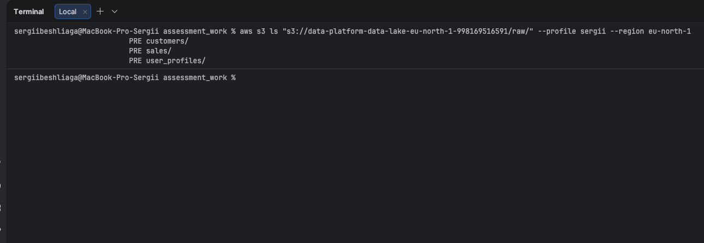
#### Перевіряємо файли в S3 бакеті
```
aws s3 ls "s3://data-platform-data-lake-eu-north-1-998169516591/raw/" --profile sergii --region eu-north-1
```


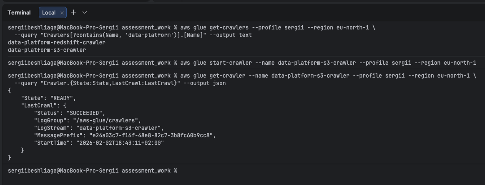
#### Перевірити Glue Crawler
```
aws glue get-crawlers --profile sergii --region eu-north-1 \
  --query "Crawlers[?contains(Name, 'data-platform')].[Name]" --output text
```

#### Запустити Glue Crawler
```
aws glue start-crawler --name data-platform-s3-crawler --profile sergii --region eu-north-1
```

#### Перевірити статус Glue Crawler
```
aws glue get-crawler --name data-platform-s3-crawler --profile sergii --region eu-north-1 \
  --query "Crawler.{State:State,LastCrawl:LastCrawl}" --output json
```

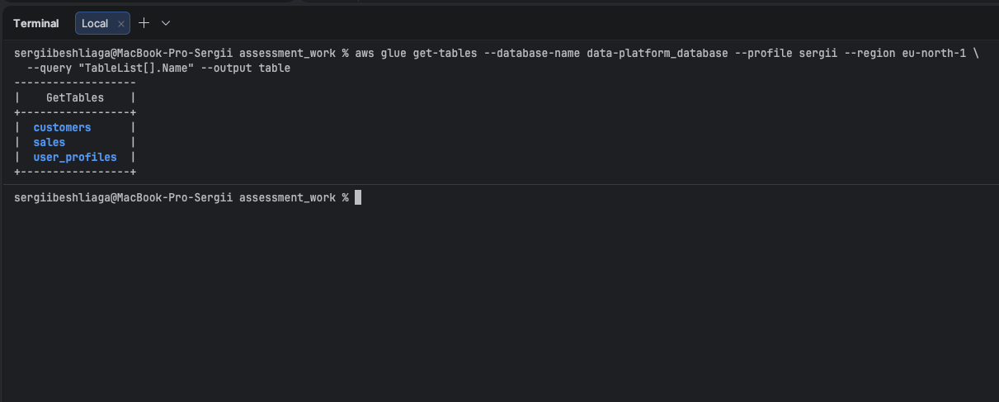
#### подивимось, які таблиці з’явились у Glue Data Catalog
```
aws glue get-tables --database-name data-platform_database --profile sergii --region eu-north-1 \
  --query "TableList[].Name" --output table
```
```
-------------------
|    GetTables    |
+-----------------+
|  customers      |
|  sales          |
|  user_profiles  |
+-----------------+
```

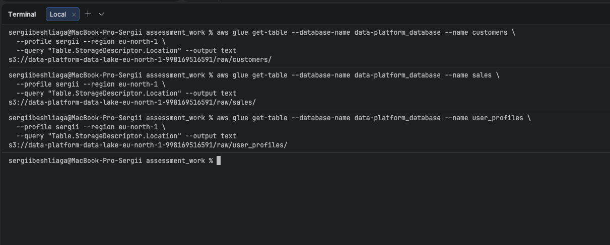
#### перевіримо, куди саме Glue “прив’язав” ці таблиці (Location)
```
aws glue get-table --database-name data-platform_database --name customers \
  --profile sergii --region eu-north-1 \
  --query "Table.StorageDescriptor.Location" --output text
```
#### куди прив’язана таблиця sales
```
aws glue get-table --database-name data-platform_database --name user_profiles \
  --profile sergii --region eu-north-1 \
  --query "Table.StorageDescriptor.Location" --output text
```

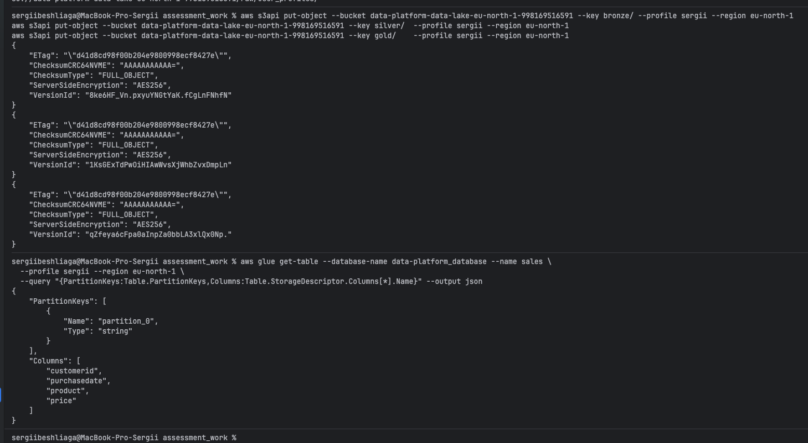
### створюємо “бронзові” таблиці (schema-on-read, всі поля STRING)
#### Створимо папки bronze/silver/gold в S3 (порожні, просто щоб було)
```
aws s3api put-object --bucket data-platform-data-lake-eu-north-1-998169516591 --key bronze/ --profile sergii --region eu-north-1
aws s3api put-object --bucket data-platform-data-lake-eu-north-1-998169516591 --key silver/  --profile sergii --region eu-north-1
aws s3api put-object --bucket data-platform-data-lake-eu-north-1-998169516591 --key gold/    --profile sergii --region eu-north-1
```

#### перевірка: чи sales у Glue розбито на partitions по датах чи ні
```
aws glue get-table --database-name data-platform_database --name sales \
  --profile sergii --region eu-north-1 \
  --query "{PartitionKeys:Table.PartitionKeys,Columns:Table.StorageDescriptor.Columns[*].Name}" --output json
```

#### SHOW PARTITIONS
```
aws athena start-query-execution \
  --profile sergii --region eu-north-1 \
  --work-group data-platform-athena-workgroup \
  --result-configuration OutputLocation=s3://data-platform-athena-results-eu-north-1-998169516591/query-results/ \
  --query-string "SHOW PARTITIONS \`data-platform_database\`.sales;"
```
{
    "QueryExecutionId": "168ee3b8-dced-46d1-a221-958eacf53469"
}

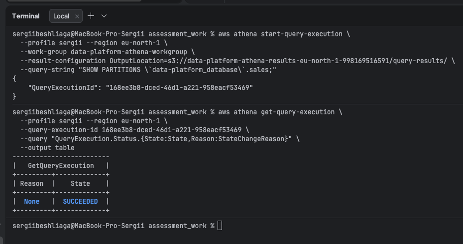
#### перевірити статус
```
aws athena get-query-execution \
  --profile sergii --region eu-north-1 \
  --query-execution-id 168ee3b8-dced-46d1-a221-958eacf53469 \
  --query "QueryExecution.Status.{State:State,Reason:StateChangeReason}" \
  --output table
```

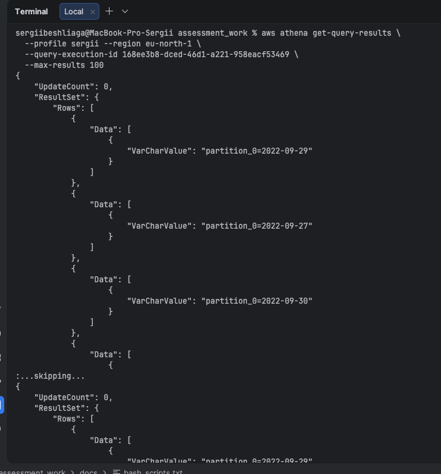
#### отримати результати
```
aws athena get-query-results \
  --profile sergii --region eu-north-1 \
  --query-execution-id 168ee3b8-dced-46d1-a221-958eacf53469 \
  --max-results 100
```

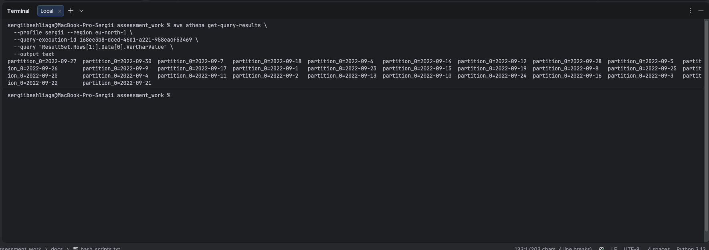
#### перевіримо, що Athena реально читає дані з партицій
```
aws athena start-query-execution \
  --profile sergii --region eu-north-1 \
  --work-group data-platform-athena-workgroup \
  --result-configuration OutputLocation=s3://data-platform-athena-results-eu-north-1-998169516591/query-results/ \
  --query-string "SELECT count(*) AS cnt FROM \`data-platform_database\`.sales;"
```

#### отримати результати (тільки значення)
```
aws athena get-query-results \
  --profile sergii --region eu-north-1 \
  --query-execution-id 168ee3b8-dced-46d1-a221-958eacf53469 \
  --query "ResultSet.Rows[1:].Data[0].VarCharValue" \
  --output text
```

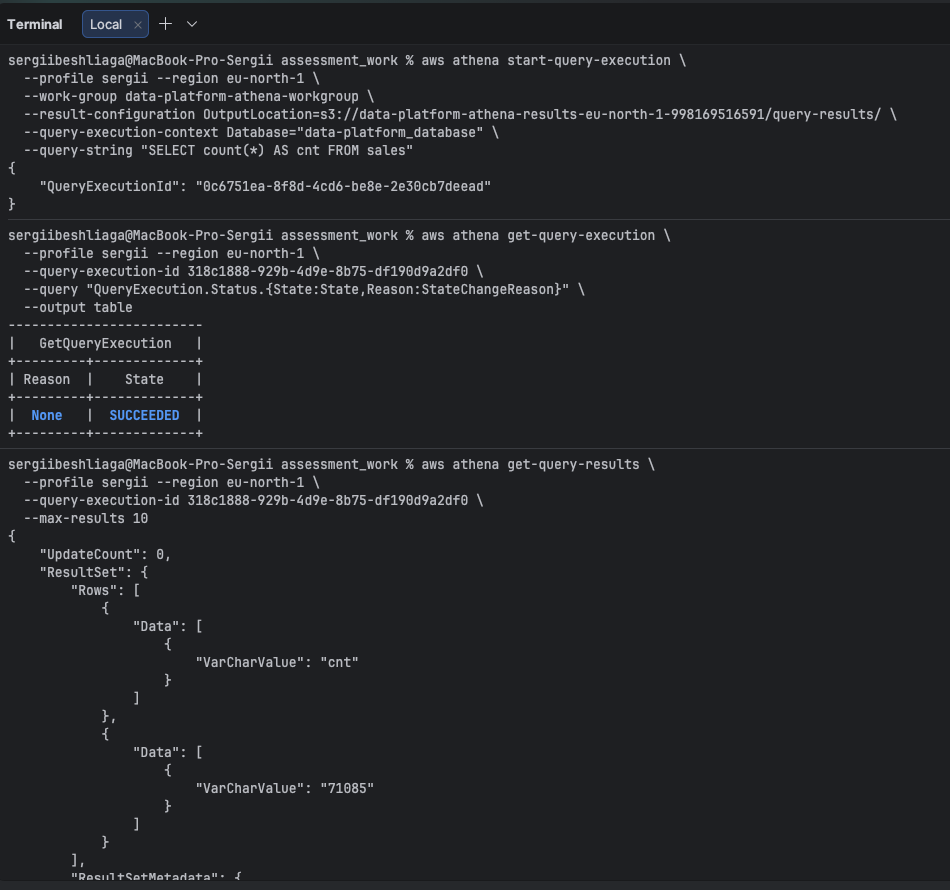
#### спростимо запит, оскільки ми зараз в контексті бази даних data-platform_database
```
aws athena start-query-execution \
  --profile sergii --region eu-north-1 \
  --work-group data-platform-athena-workgroup \
  --result-configuration OutputLocation=s3://data-platform-athena-results-eu-north-1-998169516591/query-results/ \
  --query-execution-context Database="data-platform_database" \
  --query-string "SELECT count(*) AS cnt FROM sales"
```
{
    "QueryExecutionId": "0c6751ea-8f8d-4cd6-be8e-2e30cb7deead"
}

#### перевірити статус
```
aws athena get-query-execution \
  --profile sergii --region eu-north-1 \
  --query-execution-id 318c1888-929b-4d9e-8b75-df190d9a2df0 \
  --query "QueryExecution.Status.{State:State,Reason:StateChangeReason}" \
  --output table
```

#### отримати результат
```
aws athena get-query-results \
  --profile sergii --region eu-north-1 \
  --query-execution-id 318c1888-929b-4d9e-8b75-df190d9a2df0 \
  --max-results 10
```

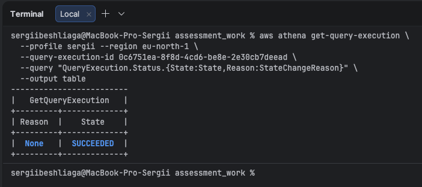
#### перевір статус нового запиту
```
aws athena get-query-execution \
  --profile sergii --region eu-north-1 \
  --query-execution-id 0c6751ea-8f8d-4cd6-be8e-2e30cb7deead \
  --query "QueryExecution.Status.{State:State,Reason:StateChangeReason}" \
  --output table
```

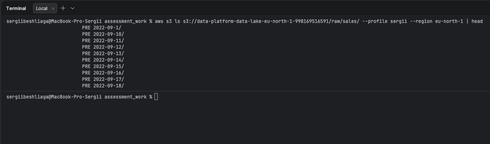
### робимо “bronze.sales” (всі колонки STRING)
#### перевіримо файли в raw/sales/ (10 перших)
```
aws s3 ls s3://data-platform-data-lake-eu-north-1-998169516591/raw/sales/ --profile sergii --region eu-north-1 | head
```

### Glue ETL: raw.sales → bronze/sales (всі STRING)
Куди пишемо:
Bronze шлях:
	•	s3://data-platform-data-lake-eu-north-1-998169516591/bronze/sales/

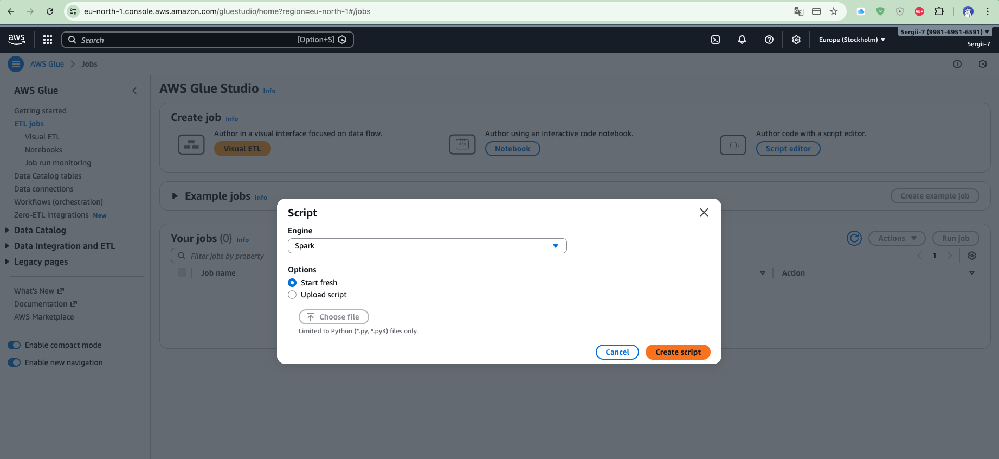
#### Створюємо Glue Job (через консоль): AWS Glue → ETL jobs → Create job

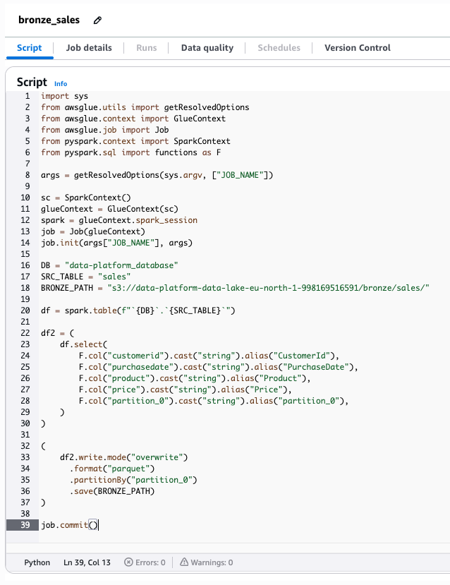
#### вставляємо код Glue Job (PySpark script)
```
import sys
from awsglue.utils import getResolvedOptions
from awsglue.context import GlueContext
from awsglue.job import Job
from pyspark.context import SparkContext
from pyspark.sql import functions as F

args = getResolvedOptions(sys.argv, ["JOB_NAME"])

sc = SparkContext()
glueContext = GlueContext(sc)
spark = glueContext.spark_session
job = Job(glueContext)
job.init(args["JOB_NAME"], args)

DB = "data-platform_database"
SRC_TABLE = "sales"
BRONZE_PATH = "s3://data-platform-data-lake-eu-north-1-998169516591/bronze/sales/"

df = spark.table(f"`{DB}`.`{SRC_TABLE}`")

df2 = (
    df.select(
        F.col("customerid").cast("string").alias("CustomerId"),
        F.col("purchasedate").cast("string").alias("PurchaseDate"),
        F.col("product").cast("string").alias("Product"),
        F.col("price").cast("string").alias("Price"),
        F.col("partition_0").cast("string").alias("partition_0"),
    )
)

(
    df2.write.mode("overwrite")
      .format("parquet")
      .partitionBy("partition_0")
      .save(BRONZE_PATH)
)

job.commit()
```

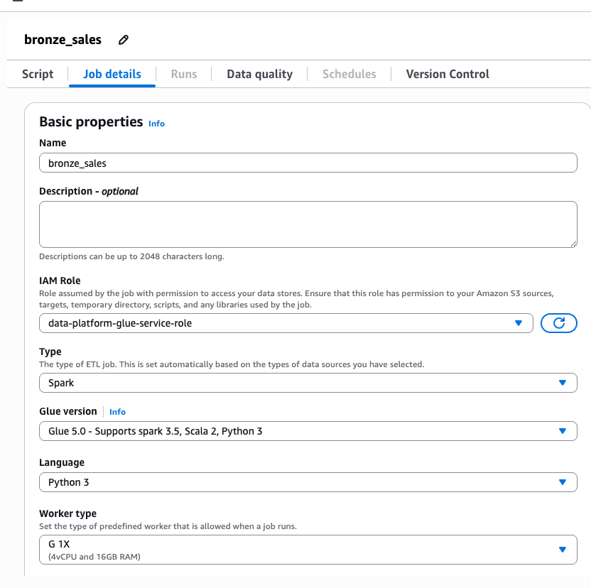
### Заповнюємо параметри Job Details
Name: `bronze_sales`
IAM Role: `data-platform-glue-service-role`
Type: `Spark`

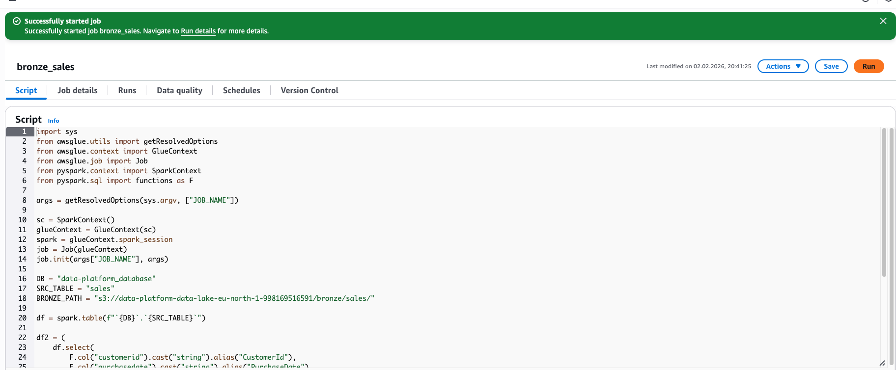
#### Click 'Save' і 'Run job'

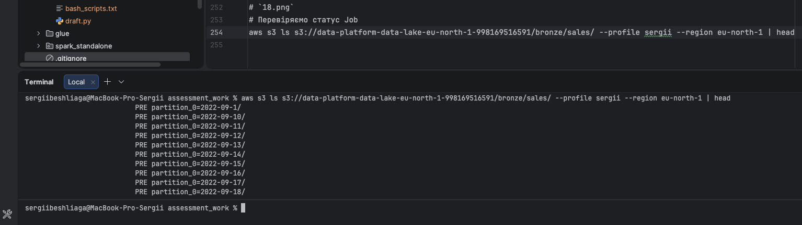

#### Перевіряємо статус Job
```
aws s3 ls s3://data-platform-data-lake-eu-north-1-998169516591/bronze/sales/ --profile sergii --region eu-north-1 | head
```


### додати bronze-таблиці в Glue Data Catalog, щоб потім читати їх у Glue/Athena як нормальні таблиці

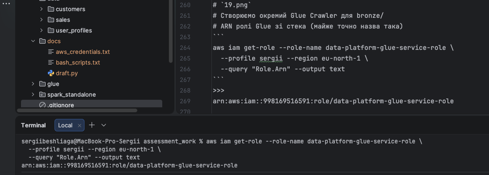

### Створюємо окремий Glue Crawler для bronze/
#### ARN ролі Glue зі стека (майже точно назва така)
```
aws iam get-role --role-name data-platform-glue-service-role \
  --profile sergii --region eu-north-1 \
  --query "Role.Arn" --output text
```
arn:aws:iam::998169516591:role/data-platform-glue-service-role

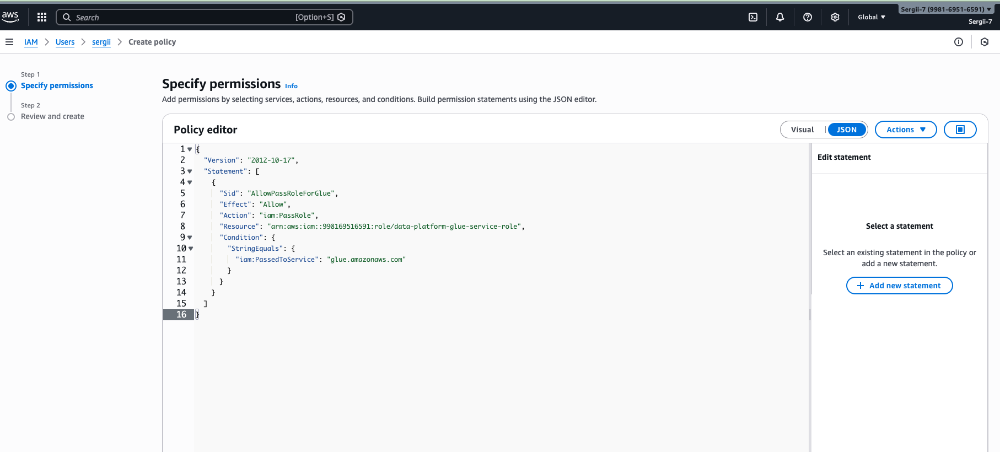

### додаємо PassRole користувачу sergii
AWS Console → IAM → Users → sergii → Add permissions → Attach policies directly → Create inline policy
#### Вкладка JSON → вставляємо:
```
{
  "Version": "2012-10-17",
  "Statement": [
    {
      "Sid": "AllowPassRoleForGlue",
      "Effect": "Allow",
      "Action": "iam:PassRole",
      "Resource": "arn:aws:iam::998169516591:role/data-platform-glue-service-role",
      "Condition": {
        "StringEquals": {
          "iam:PassedToService": "glue.amazonaws.com"
        }
      }
    }
  ]
}
```

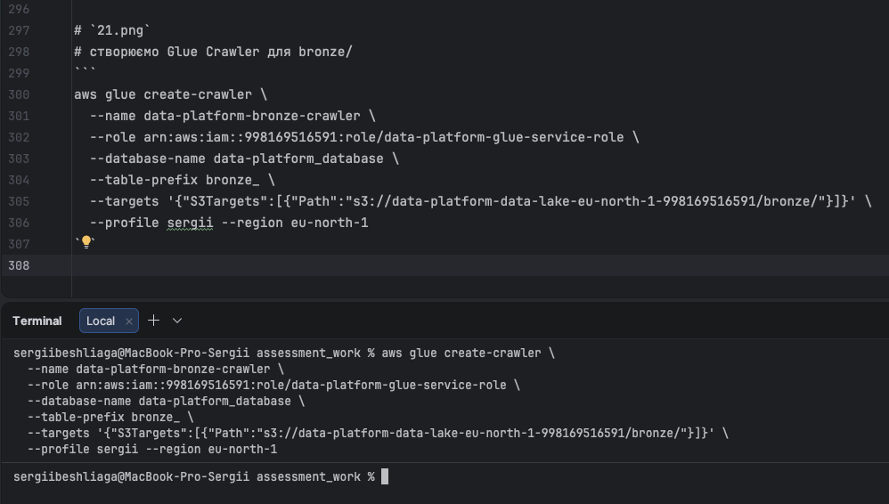

#### створюємо Glue Crawler для bronze/
```
aws glue create-crawler \
  --name data-platform-bronze-crawler \
  --role arn:aws:iam::998169516591:role/data-platform-glue-service-role \
  --database-name data-platform_database \
  --table-prefix bronze_ \
  --targets '{"S3Targets":[{"Path":"s3://data-platform-data-lake-eu-north-1-998169516591/bronze/"}]}' \
  --profile sergii --region eu-north-1
```


### наступний крок — запустити crawler і переконатися, що в Glue з’явились таблиці bronze_*


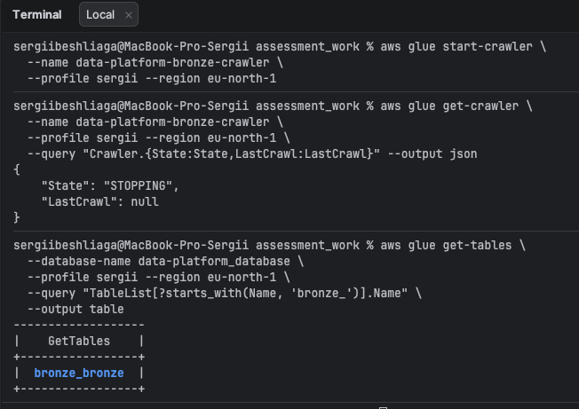
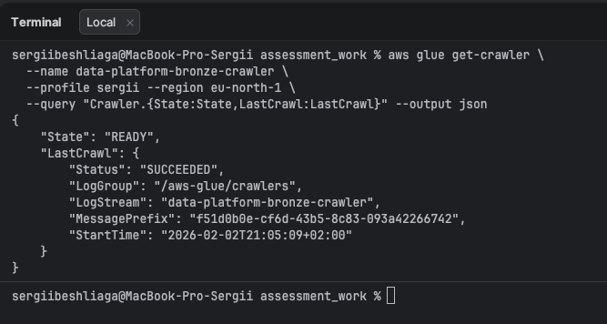

#### Запускаємо Glue Crawler
```
aws glue start-crawler \
  --name data-platform-bronze-crawler \
  --profile sergii --region eu-north-1
```
#### перевіряємо статус
```
aws glue get-crawler \
  --name data-platform-bronze-crawler \
  --profile sergii --region eu-north-1 \
  --query "Crawler.{State:State,LastCrawl:LastCrawl}" --output json
```
#### дивимось, які таблиці створились
```
aws glue get-tables \
  --database-name data-platform_database \
  --profile sergii --region eu-north-1 \
  --query "TableList[?starts_with(Name, 'bronze_')].Name" \
  --output table
 ```

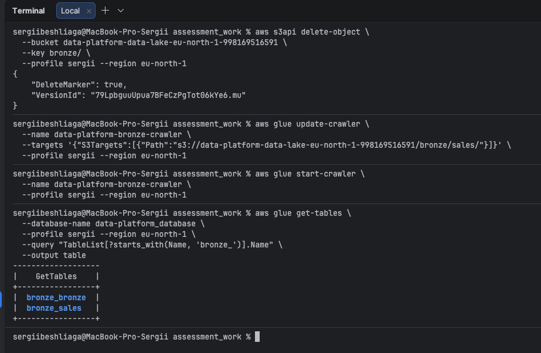

#### прибрати object bronze/ (маркер)
```
aws s3api delete-object \
  --bucket data-platform-data-lake-eu-north-1-998169516591 \
  --key bronze/ \
  --profile sergii --region eu-north-1
```
{
    "DeleteMarker": true,
    "VersionId": "79LpbguuUpua7BFeCzPgTot06kYe6.mu"
}

#### пере-ціль crawler на конкретну директорію bronze/sales/
```
aws glue update-crawler \
  --name data-platform-bronze-crawler \
  --targets '{"S3Targets":[{"Path":"s3://data-platform-data-lake-eu-north-1-998169516591/bronze/sales/"}]}' \
  --profile sergii --region eu-north-1
```
#### знову запускаємо crawler
```
aws glue start-crawler \
  --name data-platform-bronze-crawler \
  --profile sergii --region eu-north-1
```
#### перевіряємо, що зʼявилась таблиця bronze_sales
```
aws glue get-tables \
  --database-name data-platform_database \
  --profile sergii --region eu-north-1 \
  --query "TableList[?starts_with(Name, 'bronze_')].Name" \
  --output table
```

#### Видаляємо непотрібну таблицю bronze_bronze
```
aws glue delete-table \
  --database-name data-platform_database \
  --name bronze_bronze \
  --profile sergii --region eu-north-1
```

#### перевіряємо структуру таблиці bronze_sales
```
aws glue get-table \
  --database-name data-platform_database \
  --name bronze_sales \
  --profile sergii --region eu-north-1 \
  --query "{Location:Table.StorageDescriptor.Location, PartitionKeys:Table.PartitionKeys, Columns:Table.StorageDescriptor.Columns}" \
  --output json
```


### створюємо Glue скрипт (локально) 'glue/sales_bronze_to_silver.py'
#### заливаємо скрипт у S3 (візьмемо Airflow bucket)
```
aws s3 cp glue/sales_bronze_to_silver.py \
  s3://data-platform-airflow-eu-north-1-998169516591/scripts/glue/sales_bronze_to_silver.py \
  --profile sergii --region eu-north-1
```
upload: glue/sales_bronze_to_silver.py to s3://data-platform-airflow-eu-north-1-998169516591/scripts/glue/sales_bronze_to_silver.py

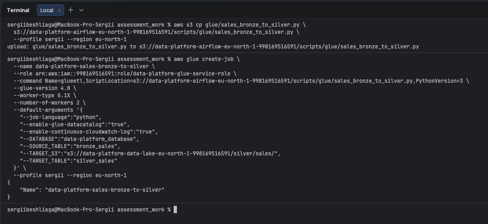

#### створюємо Glue Job (дешево)
```
aws glue create-job \
  --name data-platform-sales-bronze-to-silver \
  --role arn:aws:iam::998169516591:role/data-platform-glue-service-role \
  --command Name=glueetl,ScriptLocation=s3://data-platform-airflow-eu-north-1-998169516591/scripts/glue/sales_bronze_to_silver.py,PythonVersion=3 \
  --glue-version 4.0 \
  --worker-type G.1X \
  --number-of-workers 2 \
  --default-arguments '{
    "--job-language":"python",
    "--enable-glue-datacatalog":"true",
    "--enable-continuous-cloudwatch-log":"true",
    "--DATABASE":"data-platform_database",
    "--SOURCE_TABLE":"bronze_sales",
    "--TARGET_S3":"s3://data-platform-data-lake-eu-north-1-998169516591/silver/sales/",
    "--TARGET_TABLE":"silver_sales"
  }' \
  --profile sergii --region eu-north-1
```
{
    "Name": "data-platform-sales-bronze-to-silver"
}

#### запустити job і перевіряємо, що файли з’явились
```
aws glue start-job-run \
  --job-name data-platform-sales-bronze-to-silver \
  --profile sergii --region eu-north-1
```
{
    "JobRunId": "jr_7c36e225b56041d1969bbf8439603bd4b37be1a1638fea754e7eb026846c81ab"
}

#### перевіряємо, що файли з’явились у silver/sales/
```
aws s3 ls s3://data-platform-data-lake-eu-north-1-998169516591/silver/sales/ \
  --profile sergii --region eu-north-1 | head
```

#### перевіряємо статус Glue Job
```
aws glue get-job-run \
  --job-name data-platform-sales-bronze-to-silver \
  --run-id jr_7c36e225b56041d1969bbf8439603bd4b37be1a1638fea754e7eb026846c81ab \
  --profile sergii --region eu-north-1 \
  --query "JobRun.{State:JobRunState,Error:ErrorMessage,StartedOn:StartedOn,CompletedOn:CompletedOn}" \
  --output table
```

#### status FAILED - треба додати ROLE GlueReadAirflowBucketScripts
#### додали роль в IAM користувачу sergii


#### знову пере-запускаємо job
```
aws glue start-job-run \
  --job-name data-platform-sales-bronze-to-silver \
  --profile sergii --region eu-north-1
```
{
    "JobRunId": "jr_afbeb358db677b6f2ed13be056e0185e4789d250a7bf469a8d93c1a31f508797"
}

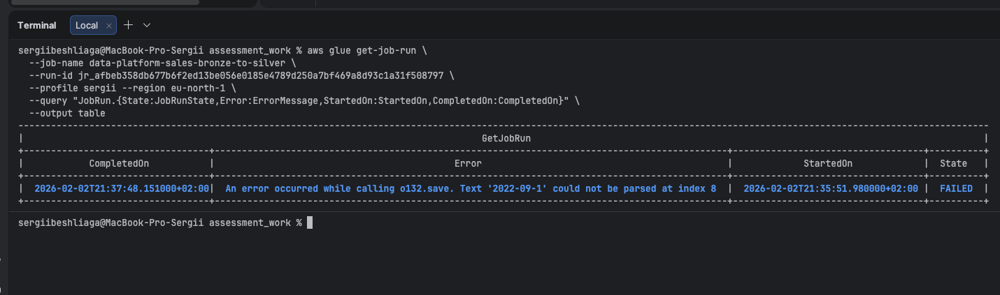

#### перевіряємо статус Glue Job
```
aws glue get-job-run \
  --job-name data-platform-sales-bronze-to-silver \
  --run-id jr_afbeb358db677b6f2ed13be056e0185e4789d250a7bf469a8d93c1a31f508797 \
  --profile sergii --region eu-north-1 \
  --query "JobRun.{State:JobRunState,Error:ErrorMessage,StartedOn:StartedOn,CompletedOn:CompletedOn}" \
  --output table
```
ERROR:
Text '2022-09-1' could not be parsed at index 8 — це дата без нуля в дні (2022-09-1 замість 2022-09-01). Твій Glue job, скоріш за все, робить to_date(..., 'yyyy-MM-dd') і падає.

#### треба виправити скрипт Glue job, щоб додати обробку таких дат
#### оновлюємо скрипт 'glue/sales_bronze_to_silver.py' локально

#### заливаємо оновлений скрипт у S3 поверх старого (той самий шлях, який у Glue Job як Script path)
```
aws s3 cp glue/sales_bronze_to_silver.py \
  s3://data-platform-airflow-eu-north-1-998169516591/scripts/glue/sales_bronze_to_silver.py \
  --profile sergii --region eu-north-1
```
upload: glue/sales_bronze_to_silver.py to s3://data-platform-airflow-eu-north-1-998169516591/scripts/glue/sales_bronze_to_silver.py

#### знову пере-запускаємо job
```
aws glue start-job-run \
  --job-name data-platform-sales-bronze-to-silver \
  --profile sergii --region eu-north-1
```
{
    "JobRunId": "jr_2907325f2243e7e6af17edc100c80d9c6dc424e68f8c50c54924b5dbd5874e37"
}

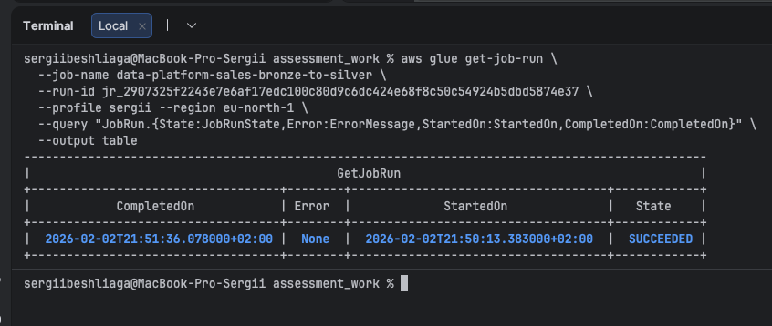

#### перевіряємо статус Glue Job
```
aws glue get-job-run \
  --job-name data-platform-sales-bronze-to-silver \
  --run-id jr_2907325f2243e7e6af17edc100c80d9c6dc424e68f8c50c54924b5dbd5874e37 \
  --profile sergii --region eu-north-1 \
  --query "JobRun.{State:JobRunState,Error:ErrorMessage,StartedOn:StartedOn,CompletedOn:CompletedOn}" \
  --output table
```
SUCCESS:
```
------------------------------------------------------------------------------------------------
|                                           GetJobRun                                          |
+-----------------------------------+--------+------------------------------------+------------+
|            CompletedOn            | Error  |             StartedOn              |   State    |
+-----------------------------------+--------+------------------------------------+------------+
|  2026-02-02T21:51:36.078000+02:00 |  None  |  2026-02-02T21:50:13.383000+02:00  |  SUCCEEDED |
+-----------------------------------+--------+------------------------------------+------------+
```

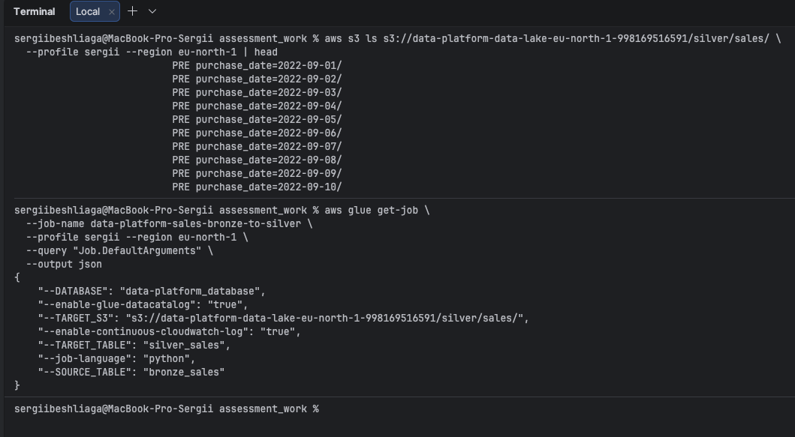

#### перевіримо, що дані реально записались у S3 (silver)
```
aws s3 ls s3://data-platform-data-lake-eu-north-1-998169516591/silver/sales/ \
  --profile sergii --region eu-north-1 | head
```
#### перевіримо структуру Glue Job (DefaultArguments)
```
aws glue get-job \
  --job-name data-platform-sales-bronze-to-silver \
  --profile sergii --region eu-north-1 \
  --query "Job.DefaultArguments" \
  --output json
```


#### створити bronze-таблицю для customers (через crawler)
```
aws glue create-crawler \
  --name data-platform-bronze-customers-crawler \
  --role arn:aws:iam::998169516591:role/data-platform-glue-service-role \
  --database-name data-platform_database \
  --table-prefix bronze_ \
  --targets '{"S3Targets":[{"Path":"s3://data-platform-data-lake-eu-north-1-998169516591/bronze/customers/"}]}' \
  --profile sergii --region eu-north-1
```
#### запускаємо crawler
```
aws glue start-crawler \
  --name data-platform-bronze-customers-crawler \
  --profile sergii --region eu-north-1
```

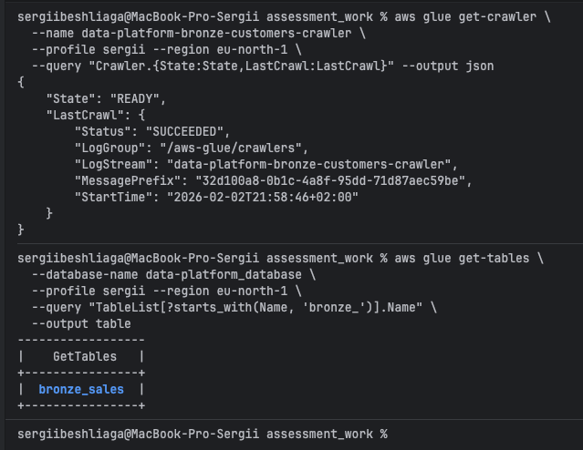

#### перевіряємо, що зʼявилась таблиця bronze_customers
```
aws glue get-tables \
  --database-name data-platform_database \
  --profile sergii --region eu-north-1 \
  --query "TableList[?starts_with(Name, 'bronze_')].Name" \
  --output table
```

#### перевіряємо наявність файлів у bronze/customers
```
aws s3 ls s3://data-platform-data-lake-eu-north-1-998169516591/bronze/customers/ \
  --profile sergii --region eu-north-1 | head
```

### створюємо Glue скрипт (локально) 'glue/customers_bronze_to_silver.py'
#### заливаємо скрипт у S3 (візьмемо Airflow bucket)
```
aws s3 cp glue/customers_raw_to_bronze.py \
  s3://data-platform-airflow-eu-north-1-998169516591/scripts/glue/customers_raw_to_bronze.py \
  --profile sergii --region eu-north-1
```
upload: glue/customers_raw_to_bronze.py to s3://data-platform-airflow-eu-north-1-998169516591/scripts/glue/customers_raw_to_bronze.py

#### створюємо Glue Job (дешево)
```
aws glue create-job \
  --name data-platform-customers-raw-to-bronze \
  --role arn:aws:iam::998169516591:role/data-platform-glue-service-role \
  --command Name=glueetl,ScriptLocation=s3://data-platform-airflow-eu-north-1-998169516591/scripts/glue/customers_raw_to_bronze.py,PythonVersion=3 \
  --glue-version 4.0 \
  --worker-type G.1X --number-of-workers 2 \
  --default-arguments '{
    "--job-language":"python",
    "--enable-glue-datacatalog":"true",
    "--enable-continuous-cloudwatch-log":"true"
  }' \
  --profile sergii --region eu-north-1
```
{
    "Name": "data-platform-customers-raw-to-bronze"
}

#### запустити job і перевіряємо, що файли з’явились
```
aws glue start-job-run \
  --job-name data-platform-customers-raw-to-bronze \
  --profile sergii --region eu-north-1
```
{
    "JobRunId": "jr_6f8e0dee7680055ba17eec32b15b9adc4d50e3a6ecf83afa0553b5b6c7b0eb61"
}

#### знову створюємо Glue Crawler для bronze/customers/
```
aws glue start-crawler \
  --name data-platform-bronze-customers-crawler \
  --profile sergii --region eu-north-1
```

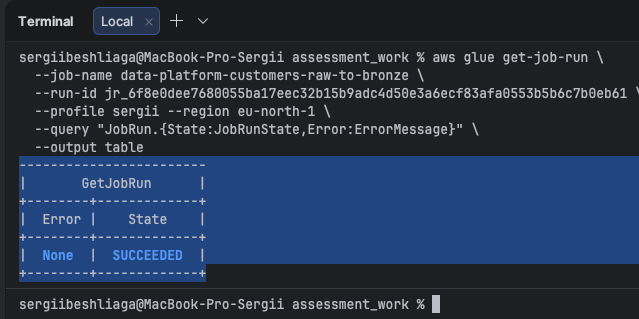

#### перевіряємо статус Glue Job
```
aws glue get-job-run \
  --job-name data-platform-customers-raw-to-bronze \
  --run-id jr_6f8e0dee7680055ba17eec32b15b9adc4d50e3a6ecf83afa0553b5b6c7b0eb61 \
  --profile sergii --region eu-north-1 \
  --query "JobRun.{State:JobRunState,Error:ErrorMessage}" \
  --output table
```
SUCCEEDED
```
------------------------
|       GetJobRun      |
+--------+-------------+
|  Error |    State    |
+--------+-------------+
|  None  |  SUCCEEDED  |
+--------+-------------+
```

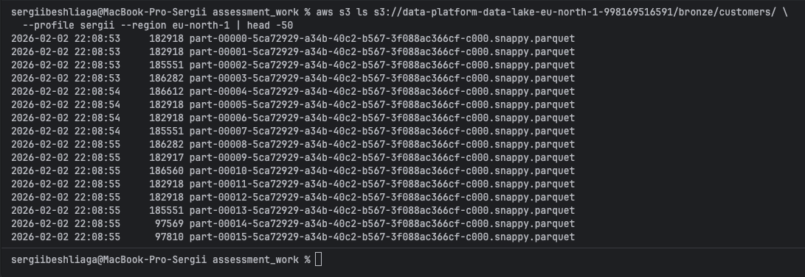

#### перевіряємо, що файли з’явились у bronze/customers/ (S3)
```
aws s3 ls s3://data-platform-data-lake-eu-north-1-998169516591/bronze/customers/ \
  --profile sergii --region eu-north-1 | head -50
```

#### запустити crawler ще раз
```
aws glue start-crawler \
  --name data-platform-bronze-customers-crawler \
  --profile sergii --region eu-north-1
```

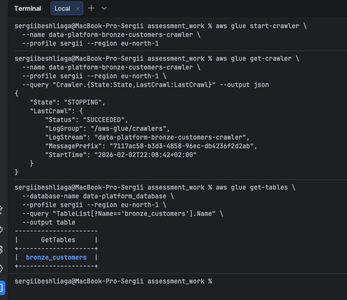

#### зачекати 30-60 секунд і перевірити статус crawler
```
aws glue get-crawler \
  --name data-platform-bronze-customers-crawler \
  --profile sergii --region eu-north-1 \
  --query "Crawler.{State:State,LastCrawl:LastCrawl}" --output json
```
{
    "State": "STOPPING",
    "LastCrawl": {
        "Status": "SUCCEEDED",
        "LogGroup": "/aws-glue/crawlers",
        "LogStream": "data-platform-bronze-customers-crawler",
        "MessagePrefix": "7117ac58-b3d3-4858-96ec-db4236f2d2ab",
        "StartTime": "2026-02-02T22:08:42+02:00"
    }
}
#### дивимось, які таблиці створились
```
aws glue get-tables \
  --database-name data-platform_database \
  --profile sergii --region eu-north-1 \
  --query "TableList[?Name=='bronze_customers'].Name" \
  --output table
```

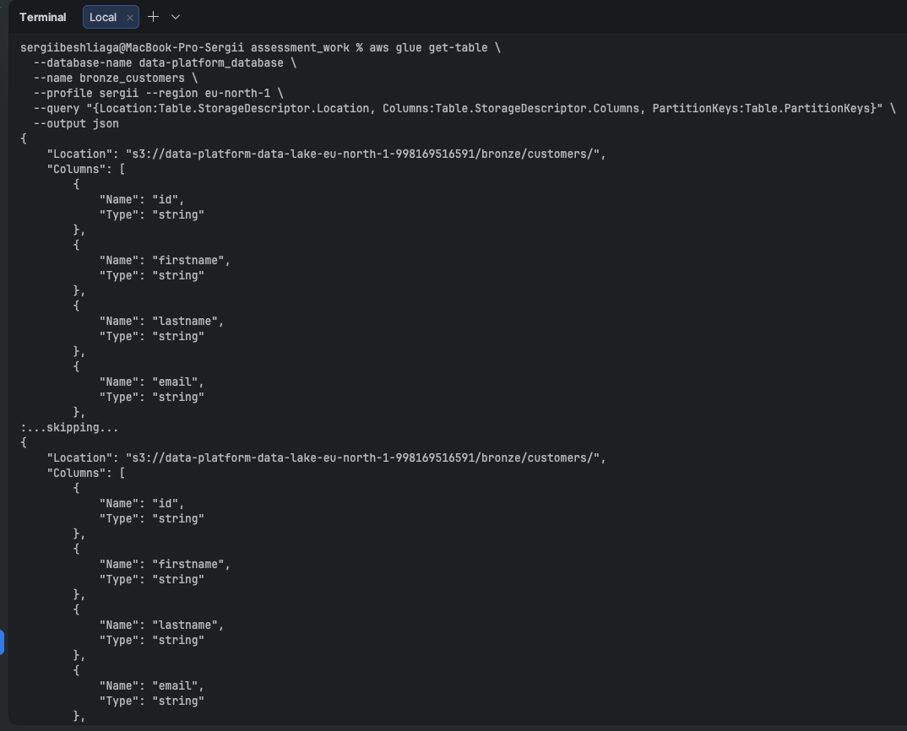

#### перевіримо схему bronze_customers
```
aws glue get-table \
  --database-name data-platform_database \
  --name bronze_customers \
  --profile sergii --region eu-north-1 \
  --query "{Location:Table.StorageDescriptor.Location, Columns:Table.StorageDescriptor.Columns, PartitionKeys:Table.PartitionKeys}" \
  --output json
```

### створюємо Glue скрипт (локально) 'glue/customers_bronze_to_silver.py'
#### заливаємо скрипт у S3 (візьмемо Airflow bucket)
```
aws s3 cp glue/customers_bronze_to_silver.py \
  s3://data-platform-airflow-eu-north-1-998169516591/scripts/glue/customers_bronze_to_silver.py \
  --profile sergii --region eu-north-1
```
upload: glue/customers_bronze_to_silver.py to s3://data-platform-airflow-eu-north-1-998169516591/scripts/glue/customers_bronze_to_silver.py

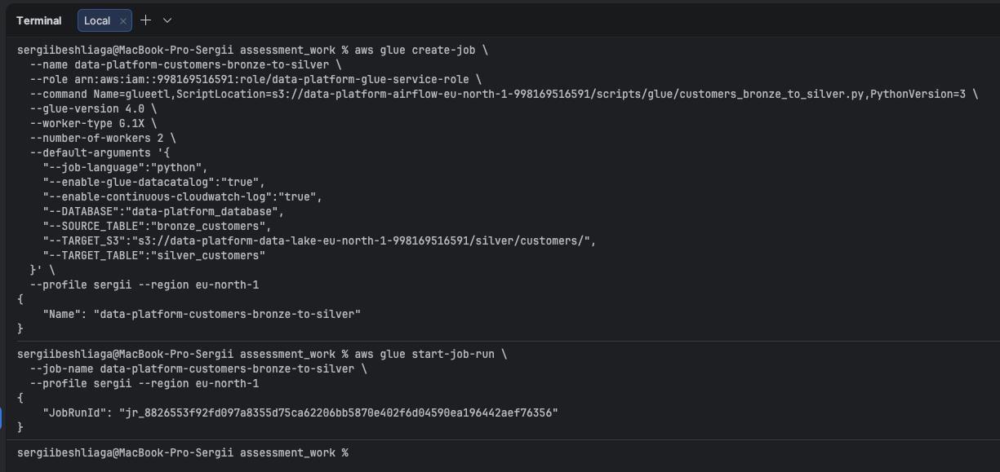

### Create Glue Job (bronze_customers → silver/customers)
```
aws glue create-job \
  --name data-platform-customers-bronze-to-silver \
  --role arn:aws:iam::998169516591:role/data-platform-glue-service-role \
  --command Name=glueetl,ScriptLocation=s3://data-platform-airflow-eu-north-1-998169516591/scripts/glue/customers_bronze_to_silver.py,PythonVersion=3 \
  --glue-version 4.0 \
  --worker-type G.1X \
  --number-of-workers 2 \
  --default-arguments '{
    "--job-language":"python",
    "--enable-glue-datacatalog":"true",
    "--enable-continuous-cloudwatch-log":"true",
    "--DATABASE":"data-platform_database",
    "--SOURCE_TABLE":"bronze_customers",
    "--TARGET_S3":"s3://data-platform-data-lake-eu-north-1-998169516591/silver/customers/",
    "--TARGET_TABLE":"silver_customers"
  }' \
  --profile sergii --region eu-north-1
```
{
    "Name": "data-platform-customers-bronze-to-silver"
}
#### запустити job
```
aws glue start-job-run \
  --job-name data-platform-customers-bronze-to-silver \
  --profile sergii --region eu-north-1
```
{
    "JobRunId": "jr_8826553f92fd097a8355d75ca62206bb5870e402f6d04590ea196442aef76356"
}

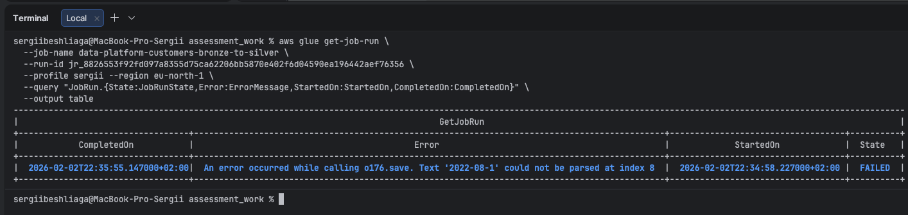

#### перевіряємо статус Glue Job
```
aws glue get-job-run \
  --job-name data-platform-customers-bronze-to-silver \
  --run-id jr_8826553f92fd097a8355d75ca62206bb5870e402f6d04590ea196442aef76356 \
  --profile sergii --region eu-north-1 \
  --query "JobRun.{State:JobRunState,Error:ErrorMessage,StartedOn:StartedOn,CompletedOn:CompletedOn}" \
  --output table
```
ERROR:
```
----------------------------------------------------------------------------------------------------------------------------------------------------------------------------------
|                                                                                    GetJobRun                                                                                   |
+----------------------------------+----------------------------------------------------------------------------------------------+-----------------------------------+----------+
|            CompletedOn           |                                            Error                                             |             StartedOn             |  State   |
+----------------------------------+----------------------------------------------------------------------------------------------+-----------------------------------+----------+
|  2026-02-02T22:35:55.147000+02:00|  An error occurred while calling o176.save. Text '2022-08-1' could not be parsed at index 8  |  2026-02-02T22:34:58.227000+02:00 |  FAILED  |
+----------------------------------+----------------------------------------------------------------------------------------------+-----------------------------------+----------+

```
### треба виправити скрипт Glue job, щоб додати обробку таких дат
#### оновлюємо скрипт 'glue/customers_bronze_to_silver.py' локально

#### заливаємо оновлений скрипт у S3 поверх старого (той самий шлях, який у Glue Job як Script path)
```
aws s3 cp glue/customers_bronze_to_silver.py \
  s3://data-platform-airflow-eu-north-1-998169516591/scripts/glue/customers_bronze_to_silver.py \
  --profile sergii --region eu-north-1
```
upload: glue/customers_bronze_to_silver.py to s3://data-platform-airflow-eu-north-1-998169516591/scripts/glue/customers_bronze_to_silver.py

#### знову пере-запускаємо job
```
aws glue start-job-run \
  --job-name data-platform-customers-bronze-to-silver \
  --profile sergii --region eu-north-1
```
{
    "JobRunId": "jr_ac091a19976aca3492023f49f3d5da9832f8f06d0ed102267a8db36717f7a6ae"
}

#### перевіряємо статус Glue Job
```
aws glue get-job-run \
  --job-name data-platform-customers-bronze-to-silver \
  --run-id jr_ac091a19976aca3492023f49f3d5da9832f8f06d0ed102267a8db36717f7a6ae \
  --profile sergii --region eu-north-1 \
  --query "JobRun.{State:JobRunState,Error:ErrorMessage,StartedOn:StartedOn,CompletedOn:CompletedOn}" \
  --output table
```
ERROR:
```
----------------------------------------------------------------------------------------------------------------------------------------------------------------------------------
|                                                                                    GetJobRun                                                                                   |
+----------------------------------+----------------------------------------------------------------------------------------------+-----------------------------------+----------+
|            CompletedOn           |                                            Error                                             |             StartedOn             |  State   |
+----------------------------------+----------------------------------------------------------------------------------------------+-----------------------------------+----------+
|  2026-02-02T22:42:42.541000+02:00|  An error occurred while calling o159.save. Text '2022-08-1' could not be parsed at index 8  |  2026-02-02T22:41:20.867000+02:00 |  FAILED  |
+----------------------------------+----------------------------------------------------------------------------------------------+-----------------------------------+----------+

```

### треба ще раз виправити скрипт Glue job, щоб додати обробку таких дат
#### оновлюємо скрипт 'glue/customers_bronze_to_silver.py' локально

#### заливаємо оновлений скрипт у S3 поверх старого (той самий шлях, який у Glue Job як Script path)
```
aws s3 cp glue/customers_bronze_to_silver.py \
  s3://data-platform-airflow-eu-north-1-998169516591/scripts/glue/customers_bronze_to_silver.py \
  --profile sergii --region eu-north-1
```
upload: glue/customers_bronze_to_silver.py to s3://data-platform-airflow-eu-north-1-998169516591/scripts/glue/customers_bronze_to_silver.py

#### знову пере-запускаємо job
```
aws glue start-job-run \
  --job-name data-platform-customers-bronze-to-silver \
  --profile sergii --region eu-north-1
```
{
    "JobRunId": "jr_b2b809fd7de33c7a770a764f911cc7776bf0039d5382314f18adba7b720e2f06"
}

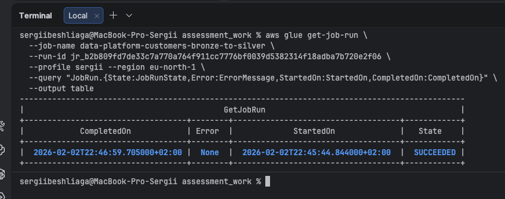

#### перевіряємо статус Glue Job
```
aws glue get-job-run \
  --job-name data-platform-customers-bronze-to-silver \
  --run-id jr_b2b809fd7de33c7a770a764f911cc7776bf0039d5382314f18adba7b720e2f06 \
  --profile sergii --region eu-north-1 \
  --query "JobRun.{State:JobRunState,Error:ErrorMessage,StartedOn:StartedOn,CompletedOn:CompletedOn}" \
  --output table
```
SUCCESS:
```
------------------------------------------------------------------------------------------------
|                                           GetJobRun                                          |
+-----------------------------------+--------+------------------------------------+------------+
|            CompletedOn            | Error  |             StartedOn              |   State    |
+-----------------------------------+--------+------------------------------------+------------+
|  2026-02-02T22:46:59.705000+02:00 |  None  |  2026-02-02T22:45:44.844000+02:00  |  SUCCEEDED |
+-----------------------------------+--------+------------------------------------+------------+
```

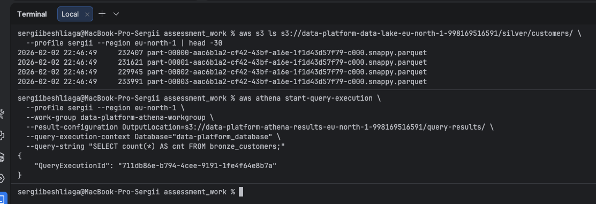
#### перевірка, що дані реально записались у S3
```
aws s3 ls s3://data-platform-data-lake-eu-north-1-998169516591/silver/customers/ \
  --profile sergii --region eu-north-1 | head -30
```

#### перевіримо обсяг рядків через Athena
```
aws athena start-query-execution \
  --profile sergii --region eu-north-1 \
  --work-group data-platform-athena-workgroup \
  --result-configuration OutputLocation=s3://data-platform-athena-results-eu-north-1-998169516591/query-results/ \
  --query-execution-context Database="data-platform_database" \
  --query-string "SELECT count(*) AS cnt FROM bronze_customers;"
```
{
    "QueryExecutionId": "711db86e-b794-4cee-9191-1fe4f64e8b7a"
}


### user_profiles → silver (він ручний в ТЗ)

#### робимо “bronze” таблицю для user_profiles (через crawler)
#### ми вже маєш raw таблицю user_profiles (CSV/JSONLine у raw), але нам треба silver.user_profiles (parquet) у S3
#### Спочатку перевіримо, що в raw файлик є
```
aws s3 ls s3://data-platform-data-lake-eu-north-1-998169516591/raw/user_profiles/ \
  --profile sergii --region eu-north-1
```
2026-02-02 18:36:35    7157412 user_profiles.json


### створити Glue job “raw → silver” для user_profiles
#### створюємо Glue скрипт (локально) 'glue/user_profiles_raw_to_silver.py'

#### заливаємо скрипт у S3 (візьмемо Airflow bucket)
```
aws s3 cp glue/user_profiles_raw_to_silver.py \
  s3://data-platform-airflow-eu-north-1-998169516591/scripts/glue/user_profiles_raw_to_silver.py \
  --profile sergii --region eu-north-1
```
upload: glue/user_profiles_raw_to_silver.py to s3://data-platform-airflow-eu-north-1-998169516591/scripts/glue/user_profiles_raw_to_silver.py

#### Create Glue Job (raw → silver)
```
aws glue create-job \
  --name data-platform-user-profiles-raw-to-silver \
  --role arn:aws:iam::998169516591:role/data-platform-glue-service-role \
  --command Name=glueetl,ScriptLocation=s3://data-platform-airflow-eu-north-1-998169516591/scripts/glue/user_profiles_raw_to_silver.py,PythonVersion=3 \
  --glue-version 4.0 \
  --worker-type G.1X \
  --number-of-workers 2 \
  --default-arguments '{
    "--job-language":"python",
    "--enable-glue-datacatalog":"true",
    "--enable-continuous-cloudwatch-log":"true",
    "--RAW_S3":"s3://data-platform-data-lake-eu-north-1-998169516591/raw/user_profiles/",
    "--TARGET_S3":"s3://data-platform-data-lake-eu-north-1-998169516591/silver/user_profiles/"
  }' \
  --profile sergii --region eu-north-1
```
{
    "Name": "data-platform-user-profiles-raw-to-silver"
}

#### запустити job
```
aws glue start-job-run \
  --job-name data-platform-user-profiles-raw-to-silver \
  --profile sergii --region eu-north-1
```
{
    "JobRunId": "jr_87832fe3d5a5f7fce8a2edb085fe00e0661fd758aa28611e96ea22227314df8a"
}

#### перевіряємо статус Glue Job
```
aws glue get-job-run \
  --job-name data-platform-user-profiles-raw-to-silver \
  --run-id jr_87832fe3d5a5f7fce8a2edb085fe00e0661fd758aa28611e96ea22227314df8a \
  --profile sergii --region eu-north-1 \
  --query "JobRun.{State:JobRunState,Error:ErrorMessage,StartedOn:StartedOn,CompletedOn:CompletedOn}" \
  --output table
```
ERROR:
```
|                                                                          GetJobRun                                                                          |
+----------------------------------+---------------------------------------------------------------------------+-----------------------------------+----------+
|            CompletedOn           |                                   Error                                   |             StartedOn             |  State   |
+----------------------------------+---------------------------------------------------------------------------+-----------------------------------+----------+
|  2026-02-02T23:02:33.389000+02:00|  AnalysisException: Parquet data source does not support void data type.  |  2026-02-02T23:00:44.746000+02:00 |  FAILED  |
+----------------------------------+---------------------------------------------------------------------------+-----------------------------------+----------+
```
#### треба виправити скрипт Glue job, щоб не було void data type
#### оновлюємо скрипт 'glue/user_profiles_raw_to_silver.py' локально

#### заливаємо оновлений скрипт у S3 поверх старого (той самий шлях, який у Glue Job як Script path)
```
aws s3 cp glue/user_profiles_raw_to_silver.py \
  s3://data-platform-airflow-eu-north-1-998169516591/scripts/glue/user_profiles_raw_to_silver.py \
  --profile sergii --region eu-north-1
```
upload: glue/user_profiles_raw_to_silver.py to s3://data-platform-airflow-eu-north-1-998169516591/scripts/glue/user_profiles_raw_to_silver.py

#### знову пере-запускаємо job
```
aws glue start-job-run \
  --job-name data-platform-user-profiles-raw-to-silver \
  --profile sergii --region eu-north-1
```
{
    "JobRunId": "jr_8b43bbce034996ca928ba6de36d0a35581e1ae5ead7971554ed4ec27bdb32bd8"
}

#### перевіряємо статус Glue Job
```
aws glue get-job-run \
  --job-name data-platform-user-profiles-raw-to-silver \
  --run-id jr_8b43bbce034996ca928ba6de36d0a35581e1ae5ead7971554ed4ec27bdb32bd8 \
  --profile sergii --region eu-north-1 \
  --query "JobRun.{State:JobRunState,Error:ErrorMessage,StartedOn:StartedOn,CompletedOn:CompletedOn}" \
  --output table
```
ERROR:
```
-----------------------------------------------------------------------------------------------------------------------------------------------------------------
|                                                                           GetJobRun                                                                           |
+----------------------------------+-----------------------------------------------------------------------------+-----------------------------------+----------+
|            CompletedOn           |                                    Error                                    |             StartedOn             |  State   |
+----------------------------------+-----------------------------------------------------------------------------+-----------------------------------+----------+
|  2026-02-02T23:11:03.195000+02:00|  AttributeError: 'DynamicFrame' object has no attribute 'drop_null_fields'  |  2026-02-02T23:10:16.381000+02:00 |  FAILED  |
+----------------------------------+-----------------------------------------------------------------------------+-----------------------------------+----------+
```

#### треба ще раз виправити скрипт Glue job, щоб не було drop_null_fields
#### оновлюємо скрипт 'glue/user_profiles_raw_to_silver.py' локально

#### заливаємо оновлений скрипт у S3 поверх старого (той самий шлях, який у Glue Job як Script path)
```
aws s3 cp glue/user_profiles_raw_to_silver.py \
  s3://data-platform-airflow-eu-north-1-998169516591/scripts/glue/user_profiles_raw_to_silver.py \
  --profile sergii --region eu-north-1
```
upload: glue/user_profiles_raw_to_silver.py to s3://data-platform-airflow-eu-north-1-998169516591/scripts/glue/user_profiles_raw_to_silver.py

#### знову пере-запускаємо job
```
aws glue start-job-run \
  --job-name data-platform-user-profiles-raw-to-silver \
  --profile sergii --region eu-north-1
```
{
    "JobRunId": "jr_3f5cca7fe09f0a91513000621ceb74f2a34cf38d7b85b1e2848db63679d6866a"
}

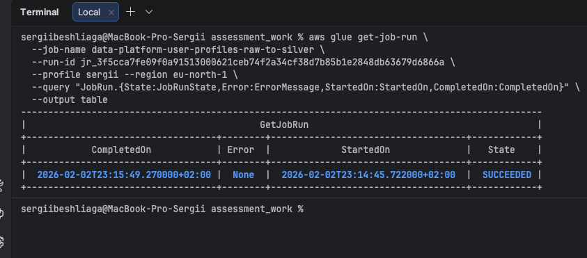

#### Перевіряємо що записалось у S3
```
aws s3 ls s3://data-platform-data-lake-eu-north-1-998169516591/silver/user_profiles/ \
  --profile sergii --region eu-north-1 | head
```
2026-02-02 23:15:38    1874311 part-00000-1d06663c-bd8d-4827-9932-900b80a8cb87-c000.snappy.parquet

#### crawler під silver/user_profiles
```
aws glue create-crawler \
  --name data-platform-silver-user-profiles-crawler \
  --role arn:aws:iam::998169516591:role/data-platform-glue-service-role \
  --database-name data-platform_database \
  --table-prefix silver_ \
  --targets '{"S3Targets":[{"Path":"s3://data-platform-data-lake-eu-north-1-998169516591/silver/user_profiles/"}]}' \
  --profile sergii --region eu-north-1
```
#### запускаємо crawler
```
aws glue start-crawler \
  --name data-platform-silver-user-profiles-crawler \
  --profile sergii --region eu-north-1
```
#### перевіряємо, що зʼявилась таблиця silver_user_profiles
```
aws glue get-tables \
  --database-name data-platform_database \
  --profile sergii --region eu-north-1 \
  --query "TableList[?Name=='silver_user_profiles'].Name" \
  --output table
```
```
--------------------------
|        GetTables       |
+------------------------+
|  silver_user_profiles  |
+------------------------+
```
#### перевіряємо, що silver_user_profiles реально дивиться в правильний S3
```
aws glue get-table \
  --database-name data-platform_database \
  --name silver_user_profiles \
  --profile sergii --region eu-north-1 \
  --query "{Location:Table.StorageDescriptor.Location, Columns:Table.StorageDescriptor.Columns[*].Name}" \
  --output json
```
{
    "Location": "s3://data-platform-data-lake-eu-north-1-998169516591/silver/user_profiles/",
    "Columns": [
        "email",
        "full_name",
        "state",
        "birth_date",
        "phone_number"
    ]
}

### Робимо, щоб у Glue з’явилися silver_sales і silver_customers (через crawlers)
#### чи вже є ці таблиці
```
aws glue get-tables \
  --database-name data-platform_database \
  --profile sergii --region eu-north-1 \
  --query "TableList[?starts_with(Name,'silver_')].Name" \
  --output table
```
```
--------------------------
|        GetTables       |
+------------------------+
|  silver_user_profiles  |
+------------------------+
```

#### перевіряємо куди він дивиться
```
aws glue get-crawler \
  --name data-platform-silver-sales-crawler \
  --profile sergii --region eu-north-1 \
  --query "Crawler.Targets.S3Targets" --output json
```
[
    {
        "Path": "s3://data-platform-data-lake-eu-north-1-998169516591/silver/sales/",
        "Exclusions": []
    }
]
#### запускаємо crawler для silver_sales
```
aws glue start-crawler \
  --name data-platform-silver-sales-crawler \
  --profile sergii --region eu-north-1
```
#### перевіряємо статус за 30-60 секунд
```
aws glue get-crawler \
  --name data-platform-silver-sales-crawler \
  --profile sergii --region eu-north-1 \
  --query "Crawler.{State:State,LastCrawl:LastCrawl}" --output json
```
{
    "State": "READY",
    "LastCrawl": {
        "Status": "SUCCEEDED",
        "LogGroup": "/aws-glue/crawlers",
        "LogStream": "data-platform-silver-sales-crawler",
        "MessagePrefix": "497eb620-1664-4e88-b612-155388f60609",
        "StartTime": "2026-02-02T23:37:55+02:00"
    }
}

#### перевіряємо, що зʼявилась таблиця silver_sales
```
aws glue get-tables \
  --database-name data-platform_database \
  --profile sergii --region eu-north-1 \
  --query "TableList[?Name=='silver_sales'].Name" \
  --output table
```
```
------------------
|    GetTables   |
+----------------+
|  silver_sales  |
+----------------+
```

#### перевіряємо, що таблиця дивиться в правильний S3 і бачить partition
```
aws glue get-table \
  --database-name data-platform_database \
  --name silver_sales \
  --profile sergii --region eu-north-1 \
  --query "{Location:Table.StorageDescriptor.Location, PartitionKeys:Table.PartitionKeys, Columns:Table.StorageDescriptor.Columns[*].Name}" \
  --output json
```
{
    "Location": "s3://data-platform-data-lake-eu-north-1-998169516591/silver/sales/",
    "PartitionKeys": [
        {
            "Name": "purchase_date",
            "Type": "string"
        }
    ],
    "Columns": [
        "client_id",
        "product_name",
        "price"
    ]
}

#### перевіримо, чи вже є silver_customers в Glue
```
aws glue get-tables \
  --database-name data-platform_database \
  --profile sergii --region eu-north-1 \
  --query "TableList[?Name=='silver_customers'].Name" \
  --output table
```

#### створюємо crawler для silver_customers
```
aws glue create-crawler \
  --name data-platform-silver-customers-crawler \
  --role arn:aws:iam::998169516591:role/data-platform-glue-service-role \
  --database-name data-platform_database \
  --table-prefix silver_ \
  --targets '{"S3Targets":[{"Path":"s3://data-platform-data-lake-eu-north-1-998169516591/silver/customers/"}]}' \
  --profile sergii --region eu-north-1
```

#### запускаємо crawler для silver_customers
```
aws glue start-crawler \
  --name data-platform-silver-customers-crawler \
  --profile sergii --region eu-north-1
```

#### перевірити, що silver_customers зʼявилась
```
aws glue get-tables \
  --database-name data-platform_database \
  --profile sergii --region eu-north-1 \
  --query "TableList[?Name=='silver_customers'].Name" \
  --output table
```

#### подивись статус crawler
```
aws glue get-crawler \
  --name data-platform-silver-customers-crawler \
  --profile sergii --region eu-north-1 \
  --query "Crawler.{State:State,LastCrawl:LastCrawl}" \
  --output json
```
{
    "State": "READY",
    "LastCrawl": {
        "Status": "SUCCEEDED",
        "LogGroup": "/aws-glue/crawlers",
        "LogStream": "data-platform-silver-customers-crawler",
        "MessagePrefix": "8ab69a7b-a675-452d-89ec-1bf5097de2b5",
        "StartTime": "2026-02-02T23:45:54+02:00"
    }
}

#### перевіряємо, що таблиця існує
```
aws glue get-tables \
  --database-name data-platform_database \
  --profile sergii --region eu-north-1 \
  --query "TableList[?starts_with(Name,'silver_')].Name" \
  --output table
```
```
--------------------------
|        GetTables       |
+------------------------+
|  silver_customers      |
|  silver_sales          |
|  silver_user_profiles  |
+------------------------+
```

#### silver_customers зʼявилась, перевіряємо її Location
```
aws glue get-table \
  --database-name data-platform_database \
  --name silver_customers \
  --profile sergii --region eu-north-1 \
  --query "{Location:Table.StorageDescriptor.Location, Columns:Table.StorageDescriptor.Columns[*].Name}" \
  --output json
```
{
    "Location": "s3://data-platform-data-lake-eu-north-1-998169516591/silver/customers/",
    "Columns": [
        "client_id",
        "first_name",
        "last_name",
        "email",
        "registration_date",
        "state"
    ]
}

### перевіримо, що Athena читає всі 3 silver-таблиці (це важливо перед “gold”)
#### 1) silver_customers
```
aws athena start-query-execution \
  --profile sergii --region eu-north-1 \
  --work-group data-platform-athena-workgroup \
  --result-configuration OutputLocation=s3://data-platform-athena-results-eu-north-1-998169516591/query-results/ \
  --query-execution-context Database="data-platform_database" \
  --query-string "SELECT count(*) AS cnt FROM silver_customers;"
```
{
    "QueryExecutionId": "86e19b78-917a-446d-a706-0156e84e7066"
}
#### 2) silver_sales
```
aws athena start-query-execution \
  --profile sergii --region eu-north-1 \
  --work-group data-platform-athena-workgroup \
  --result-configuration OutputLocation=s3://data-platform-athena-results-eu-north-1-998169516591/query-results/ \
  --query-execution-context Database="data-platform_database" \
  --query-string "SELECT count(*) AS cnt FROM silver_sales;"
```
{
    "QueryExecutionId": "ce579dbf-8ae4-4686-a79e-0c60d0fc8c61"
}
#### 3) silver_user_profiles
```
aws athena start-query-execution \
  --profile sergii --region eu-north-1 \
  --work-group data-platform-athena-workgroup \
  --result-configuration OutputLocation=s3://data-platform-athena-results-eu-north-1-998169516591/query-results/ \
  --query-execution-context Database="data-platform_database" \
  --query-string "SELECT count(*) AS cnt FROM silver_user_profiles;"
```
{
    "QueryExecutionId": "a69f178a-102b-4f97-93d1-44394597bc91"
}

#### Крок 1 — дістати cnt для silver_customers
```
aws athena get-query-results \
  --profile sergii --region eu-north-1 \
  --query-execution-id 86e19b78-917a-446d-a706-0156e84e7066 \
  --query "ResultSet.Rows[1].Data[0].VarCharValue" \
  --output text
```
47469

#### Крок 2 — дістати cnt для silver_sales
```
aws athena get-query-results \
  --profile sergii --region eu-north-1 \
  --query-execution-id ce579dbf-8ae4-4686-a79e-0c60d0fc8c61 \
  --query "ResultSet.Rows[1].Data[0].VarCharValue" \
  --output text
```
68714

#### Крок 3 — дістати cnt для silver_user_profiles
```
aws athena get-query-results \
  --profile sergii --region eu-north-1 \
  --query-execution-id a69f178a-102b-4f97-93d1-44394597bc91 \
  --query "ResultSet.Rows[1].Data[0].VarCharValue" \
  --output text
```
47469

#### перевірити статус
```
aws athena get-query-execution \
  --profile sergii --region eu-north-1 \
  --query-execution-id 86e19b78-917a-446d-a706-0156e84e7066 \
  --query "QueryExecution.Status.{State:State,Reason:StateChangeReason}" \
  --output table
```
SUCCESS
```
-------------------------
|   GetQueryExecution   |
+---------+-------------+
| Reason  |    State    |
+---------+-------------+
|  None   |  SUCCEEDED  |
+---------+-------------+
```

### Тепер робимо GOLD (join): з’єднаємо silver_sales + silver_customers + silver_user_profiles і запишемо в s3://.../gold/sales_enriched/, потім crawler і перевірка в Athena.

#### Створюємо локально скрипт Glue job для gold `glue/gold_sales_enriched.py`
#### заливаємо скрипт у S3 (візьмемо Airflow bucket)
```
aws s3 cp glue/gold_sales_enriched.py \
  s3://data-platform-airflow-eu-north-1-998169516591/scripts/glue/gold_sales_enriched.py \
  --profile sergii --region eu-north-1
```
upload: glue/gold_sales_enriched.py to s3://data-platform-airflow-eu-north-1-998169516591/scripts/glue/gold_sales_enriched.py

#### Create Glue Job (silver → gold)
```
aws glue create-job \
  --name data-platform-gold-sales-enriched \
  --role arn:aws:iam::998169516591:role/data-platform-glue-service-role \
  --command Name=glueetl,ScriptLocation=s3://data-platform-airflow-eu-north-1-998169516591/scripts/glue/gold_sales_enriched.py,PythonVersion=3 \
  --glue-version 4.0 \
  --worker-type G.1X \
  --number-of-workers 2 \
  --default-arguments '{
    "--job-language":"python",
    "--enable-glue-datacatalog":"true",
    "--enable-continuous-cloudwatch-log":"true",
    "--DATABASE":"data-platform_database",
    "--SALES_TABLE":"silver_sales",
    "--CUSTOMERS_TABLE":"silver_customers",
    "--PROFILES_TABLE":"silver_user_profiles",
    "--TARGET_S3":"s3://data-platform-data-lake-eu-north-1-998169516591/gold/sales_enriched/"
  }' \
  --profile sergii --region eu-north-1
```
{
    "Name": "data-platform-gold-sales-enriched"
}

#### запустити job
```
aws glue start-job-run \
  --job-name data-platform-gold-sales-enriched \
  --profile sergii --region eu-north-1
```
{
    "JobRunId": "jr_21350f43a7a18de950e09f25a4209122b5d8e60117209963e502e1f995655eda"
}

#### перевіряємо статус Glue Job
```
aws glue get-job-run \
  --job-name data-platform-gold-sales-enriched \
  --run-id jr_21350f43a7a18de950e09f25a4209122b5d8e60117209963e502e1f995655eda \
  --profile sergii --region eu-north-1 \
  --query "JobRun.{State:JobRunState,Error:ErrorMessage,StartedOn:StartedOn,CompletedOn:CompletedOn}" \
  --output table
```
SUCCESS
```
------------------------------------------------------------------------------------------------
|                                           GetJobRun                                          |
+-----------------------------------+--------+------------------------------------+------------+
|            CompletedOn            | Error  |             StartedOn              |   State    |
+-----------------------------------+--------+------------------------------------+------------+
|  2026-02-03T00:04:40.197000+02:00 |  None  |  2026-02-03T00:03:29.264000+02:00  |  SUCCEEDED |
+-----------------------------------+--------+------------------------------------+------------+
```

#### перевірка, що дані реально записались у S3
```
aws s3 ls s3://data-platform-data-lake-eu-north-1-998169516591/gold/sales_enriched/ \
  --profile sergii --region eu-north-1 | head
```


#### Crawler під GOLD (щоб з’явилась таблиця gold_sales_enriched)
```
aws glue create-crawler \
  --name data-platform-gold-sales-enriched-crawler \
  --role arn:aws:iam::998169516591:role/data-platform-glue-service-role \
  --database-name data-platform_database \
  --table-prefix gold_ \
  --targets '{"S3Targets":[{"Path":"s3://data-platform-data-lake-eu-north-1-998169516591/gold/sales_enriched/"}]}' \
  --profile sergii --region eu-north-1
```

#### запускаємо crawler
```
aws glue start-crawler \
  --name data-platform-gold-sales-enriched-crawler \
  --profile sergii --region eu-north-1
```

#### перевіряємо, що зʼявилась таблиця gold_sales_enriched
```
aws glue get-tables \
  --database-name data-platform_database \
  --profile sergii --region eu-north-1 \
  --query "TableList[?Name=='gold_sales_enriched'].Name" \
  --output table
```
SUCCESS
```
-------------------------
|       GetTables       |
+-----------------------+
|  gold_sales_enriched  |
+-----------------------+
```
#### статус crawler (це головне)
```
aws glue get-crawler \
  --name data-platform-gold-sales-enriched-crawler \
  --profile sergii --region eu-north-1 \
  --query "Crawler.{State:State,LastCrawl:LastCrawl}" --output json
```
{
    "State": "READY",
    "LastCrawl": {
        "Status": "SUCCEEDED",
        "LogGroup": "/aws-glue/crawlers",
        "LogStream": "data-platform-gold-sales-enriched-crawler",
        "MessagePrefix": "9e83bb67-7183-4ed8-a388-0e824b60fd88",
        "StartTime": "2026-02-03T00:08:43+02:00"
    }
}

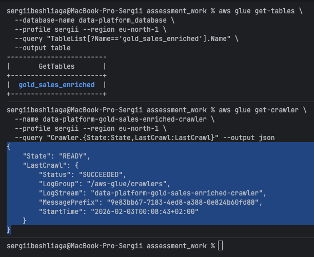

#### перевіряємо куди дивиться таблиця + колонки + партиції
```
aws glue get-table \
  --database-name data-platform_database \
  --name gold_sales_enriched \
  --profile sergii --region eu-north-1 \
  --query "{Location:Table.StorageDescriptor.Location,PartitionKeys:Table.PartitionKeys,Columns:Table.StorageDescriptor.Columns[*].Name}" \
  --output json
```
{
    "Location": "s3://data-platform-data-lake-eu-north-1-998169516591/gold/sales_enriched/",
    "PartitionKeys": [
        {
            "Name": "purchase_date",
            "Type": "string"
        }
    ],
    "Columns": [
        "client_id",
        "first_name",
        "last_name",
        "email",
        "state",
        "registration_date",
        "full_name",
        "birth_date",
        "phone_number",
        "product_name",
        "price"
    ]
}

#### Перевірка в Athena (COUNT)
```
aws athena start-query-execution \
  --profile sergii --region eu-north-1 \
  --work-group data-platform-athena-workgroup \
  --result-configuration OutputLocation=s3://data-platform-athena-results-eu-north-1-998169516591/query-results/ \
  --query-execution-context Database="data-platform_database" \
  --query-string "SELECT count(*) AS cnt FROM gold_sales_enriched;"
```
{
    "QueryExecutionId": "35142de2-ea09-4c64-b741-9847d5c1465d"
}

#### перевіряємо результат
```
aws athena get-query-results \
  --profile sergii --region eu-north-1 \
  --query-execution-id 35142de2-ea09-4c64-b741-9847d5c1465d \
  --query "ResultSet.Rows[1].Data[0].VarCharValue" \
  --output text
```
68714

#### “контрольна” перевірку даних з gold_sales_enriched (перші 5 рядків)
```
aws athena start-query-execution \
  --profile sergii --region eu-north-1 \
  --work-group data-platform-athena-workgroup \
  --result-configuration OutputLocation=s3://data-platform-athena-results-eu-north-1-998169516591/query-results/ \
  --query-execution-context Database="data-platform_database" \
  --query-string "SELECT * FROM gold_sales_enriched LIMIT 5;"
```
{
    "QueryExecutionId": "be249f81-fe9c-4882-b50b-761fcb481782"
}

#### 1) Подивитися результат “дублікатів” (QueryExecutionId fa255...)
```
aws athena get-query-execution \
  --profile sergii --region eu-north-1 \
  --query-execution-id fa255212-4b6e-41e2-bfb8-e2ef5404967b \
  --query "QueryExecution.Status.{State:State,Reason:StateChangeReason}" \
  --output table

aws athena get-query-results \
  --profile sergii --region eu-north-1 \
  --query-execution-id fa255212-4b6e-41e2-bfb8-e2ef5404967b \
  --query "ResultSet.Rows[*].Data[*].VarCharValue" \
  --output text
```
SUCCESS
```
-------------------------
|   GetQueryExecution   |
+---------+-------------+
| Reason  |    State    |
+---------+-------------+
|  None   |  SUCCEEDED  |
+---------+-------------+
purchase_date   client_id       product_name    c
2022-09-21      10339   Microwave oven  2
2022-09-21      30332   Vacuum cleaner  2
2022-09-21      37094   Laptop  2
2022-09-28      23090   TV      2
2022-09-14      34747   coffee machine  2
2022-09-28      41594   TV      2
2022-09-28      137     coffee machine  2
2022-09-23      30837   Vacuum cleaner  2
2022-09-05      6977    Vacuum cleaner  2
2022-09-06      38765   TV      2
2022-09-17      17      TV      2
2022-09-07      39004   Phone   2
2022-09-14      31668   Microwave oven  2
2022-09-07      45684   Microwave oven  2
2022-09-28      33845   Vacuum cleaner  2
2022-09-28      35219   Microwave oven  2
2022-09-02      14400   coffee machine  2
```
#### 2.1) Подивитися партиції gold (QueryExecutionId b617...)
```
aws athena get-query-execution \
  --profile sergii --region eu-north-1 \
  --query-execution-id b617d415-b976-4884-babf-03dbe0f42d04 \
  --query "QueryExecution.Status.{State:State,Reason:StateChangeReason}" \
  --output table

aws athena get-query-results \
  --profile sergii --region eu-north-1 \
  --query-execution-id b617d415-b976-4884-babf-03dbe0f42d04 \
  --max-results 200
```
SUCCESS
```
-------------------------
|   GetQueryExecution   |
+---------+-------------+
| Reason  |    State    |
+---------+-------------+
|  None   |  SUCCEEDED  |
+---------+-------------+
{
    "UpdateCount": 0,
    "ResultSet": {
        "Rows": [
            {
                "Data": [
                    {
                        "VarCharValue": "purchase_date=2022-09-11"
                    }
                ]
            },
            {
                "Data": [
                    {
                        "VarCharValue": "purchase_date=2022-09-03"
                    }
                ]
            },
:
```
#### 2.2) Партиції gold (списком в текст)
```
aws athena get-query-results \
  --profile sergii --region eu-north-1 \
  --query-execution-id b617d415-b976-4884-babf-03dbe0f42d04 \
  --query "ResultSet.Rows[*].Data[0].VarCharValue" \
  --output text
```
purchase_date=2022-09-11        purchase_date=2022-09-03        purchase_date=2022-09-09        purchase_date=2022-09-13        purchase_date=2022-09-19        purchase_date=2022-09-16        purchase_date=2022-09-06              purchase_date=2022-09-21        purchase_date=2022-09-18        purchase_date=2022-09-25        purchase_date=2022-09-15        purchase_date=2022-09-22        purchase_date=2022-09-29        purchase_date=2022-09-02      purchase_date=2022-09-28        purchase_date=2022-09-12        purchase_date=2022-09-17        purchase_date=2022-09-07        purchase_date=2022-09-20        purchase_date=2022-09-24        purchase_date=2022-09-14      purchase_date=2022-09-05        purchase_date=2022-09-27        purchase_date=2022-09-26        purchase_date=2022-09-04        purchase_date=2022-09-23        purchase_date=2022-09-10        purchase_date=2022-09-01      purchase_date=2022-09-08

> Примітка: `SHOW PARTITIONS` повертає список не обов’язково відсортований. Якщо треба акуратно відсортувати вивід локально:

```
aws athena get-query-results \
  --profile sergii --region eu-north-1 \
  --query-execution-id b617d415-b976-4884-babf-03dbe0f42d04 \
  --query "ResultSet.Rows[*].Data[0].VarCharValue" \
  --output text | tr '\t' '\n' | sort
```


#### 3.1) Фінальний запит по ТЗ (штат з найбільшою кількістю TV, вік 20–30, 1–10 вересня)
```
aws athena start-query-execution \
  --profile sergii --region eu-north-1 \
  --work-group data-platform-athena-workgroup \
  --result-configuration OutputLocation=s3://data-platform-athena-results-eu-north-1-998169516591/query-results/ \
  --query-execution-context Database="data-platform_database" \
  --query-string "
WITH base AS (
  SELECT
    state,
    lower(trim(product_name)) AS product_name_norm,
    try_cast(purchase_date AS date) AS pd,
    try_cast(birth_date AS date) AS bd
  FROM gold_sales_enriched
)
SELECT
  state,
  count(*) AS tv_cnt
FROM base
WHERE state IS NOT NULL
  AND product_name_norm = 'tv'
  AND pd BETWEEN date '2022-09-01' AND date '2022-09-10'
  AND bd IS NOT NULL
  AND date_diff('year', bd, pd) BETWEEN 20 AND 30
GROUP BY state
ORDER BY tv_cnt DESC
LIMIT 10;
"
```
{
    "QueryExecutionId": "075f26ea-7ee7-4358-bc8a-84f32941c567"
}

#### 3.2) Перевіряємо результат фінального запиту
```
aws athena get-query-execution \
  --profile sergii --region eu-north-1 \
  --query-execution-id 075f26ea-7ee7-4358-bc8a-84f32941c567 \
  --query "QueryExecution.Status.{State:State,Reason:StateChangeReason}" \
  --output table
```
SUCCESS
```
-------------------------
|   GetQueryExecution   |
+---------+-------------+
| Reason  |    State    |
+---------+-------------+
|  None   |  SUCCEEDED  |
+---------+-------------+
```

#### 3.3) Дістаємо результат фінального запиту
```
aws athena get-query-results \
  --profile sergii --region eu-north-1 \
  --query-execution-id 075f26ea-7ee7-4358-bc8a-84f32941c567 \
  --query "ResultSet.Rows[*].Data[*].VarCharValue" \
  --output text
```
```
state   tv_cnt
Idaho   180
Iowa    173
Ohio    171
Texas   165
Utah    163
Maine   157
```

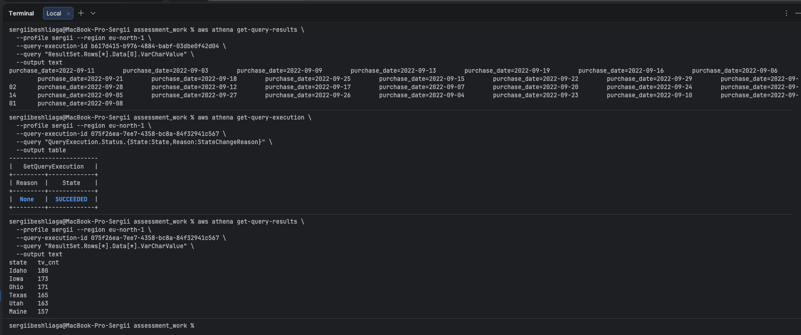

✅ Висновок по ТЗ: штат з найбільшою кількістю покупок TV серед клієнтів 20–30 років у період 2022-09-01…2022-09-10 — **Idaho** (tv_cnt = **180**).

